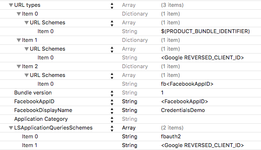

# Kitura-Credentials-Sample
A sample web application for authentication using Kitura-Credentials

[](https://travis-ci.org/IBM-Swift/Kitura-Credentials-Sample)


## Summary

This is a sample [Kitura](https://github.com/IBM-Swift/Kitura) application for authentication using [Kitura-Credentials](https://github.com/IBM-Swift/Kitura-Credentials). See instructions for [Installation on OS X ](https://github.com/IBM-Swift/Kitura#installation-os-x) or [Installation on Linux](https://github.com/IBM-Swift/Kitura#installation-linux-apt-based).

This sample shows both redirecting authentication with sessions using Facebook and Google login, and non-redirecting HTTP Basic and Digest authentication, and authentication with Facebook or Google OAuth token.

KituraCredentialsDemo application is a sample iOS application that shows the client side of authentication with OAuth tokens.

## Swift version
The latest version of Kitura-Credentials-Sample requires **Swift 4.0**. You can download this version of the Swift binaries by following this [link](https://swift.org/download/). Compatibility with other Swift versions is not guaranteed.

## Table of Contents

* [Running Kitura-Credentials-Sample with Facebook and Google web login](#running-kitura-credentials-sample-with-facebook-and-google-web-login)
* [Build and run Kitura-Credentials-Sample](#build-and-run-kitura-credentials-sample)
* [Running KituraCredentialsDemo](#running-kituracredentialsdemo)
* [License](#license)

## Running Kitura-Credentials-Sample with Facebook and Google web login

This section is only relevant to Facebook and Google web login. If you are only interested in HTTP or OAuth token authentication, you can skip this section.

In order to use Facebook and Google web login, application instances must be created on Facebook and Google websites.

### Facebook

1. To create an application instance on Facebook's website, go to  [Facebook developers page](https://developers.facebook.com/apps/) page, and add a new app. Choose `Website` as your platform. Follow the steps to create a new app.

2. Go to Developer dashboard and copy App Id and App Secret to `PagesCredentials.swift`:
```swift
let fbClientId = // Put App Id here
let fbClientSecret = // Put App Secret here
```
3. Configure Facebook callback URL in `PagesCredentials.swift`. It should be your Site URL as you configured it on Facebook plus `/login/facebook/callback`:
```swift
let fbCallbackUrl = // Put your callback URL here
```

### Google

1. Go to [Google developers console](https://console.developers.google.com/) page, and create  a new project.

2. Go to `Credentials` tab, click `Create credentials` and choose `OAuth client ID`.

3. Tap `Configure consent screen` and fill in the details.

4. Back to `Credentials`, choose `Web application` as your application type. In order to enable callbacks from Google, type your server URL plus `/login/google/callback` in `Authorized redirect URIs` - this is required to make Google authentication work.

5. Now you should see the app you just created in `Credentials` tab. Click on its name, and copy Client ID and Client secret  to `PagesCredentials.swift`:
```swift
let googleClientId = // Put Client Id here
let googleClientSecret = // Put Client Secret here
```
6. Set your Google callback URL in `PagesCredentials.swift`:
```swift
let googleCallbackUrl = // Put your callback URL here
```


## Build and run Kitura-Credentials-Sample

1. `swift build`

  You should see message _Listening on port 8080_. The result executable is located in `.build/debug` directory: `./.build/debug/KituraCredentialsSample`
  
2. For Facebook/Google login, open your browser at [http://localhost:8080/private/pages/data](http://localhost:8080/private/pages/data).

3. For HTTP authentication, open [http://localhost:8080/private/api/data](http://localhost:8080/private/api/data). For this path, Digest authentication will be performed.

4. For HTTP Basic authentication, open your browser at [http://localhost:8080/private/basic/api/data](http://localhost:8080/private/basic/api/data).

5. For Facebook/Google OAuth token authentication, run KituraCredentialsDemo as explained in the next section.


## Running KituraCredentialsDemo

KituraCredentialsDemo application is a sample iOS application that shows the client side of authentication with OAuth tokens. After signing in using either Facebook or Google the user can request private data from Kitura-Credentials-Sample server. The app sends a request to /private/api/data with either Facebook or Google OAuth token.

### 1. Create an application instance on Facebook and Google
In order to enable Facebook and Google sign in the app, you have to create application instances.

##### Facebook

1. To create an application instance on Facebook's website, first go to [Facebook's Quick Start for iOS](https://developers.facebook.com/quickstarts/?platform=ios) page. Type 	`CredentialsDemo` as the name of your new Facebook app and click the `Create New Facebook App ID` button.

1. On the screen that follows, in the `Configure your info.plist` section under `step 2`, copy the information into your `info.plist` file. You can find the `info.plist` file in `Configuration` folder of the Xcode project. If you have trouble finding the `CFBundleURLType` key, note that Xcode changes the `CFBundleURLType` key to `URL types` when the key is entered.

1. Next scroll to the bottom of the quick start page where it says `Supply us with your Bundle Identifier` and enter the app's bundle identifier.

1. Once you entered the bundle ID on the Facebook quick start page, click `next`. That's it for the Facebook quick start setup.


##### Google

1. Go to [Enable Google services for your app](https://developers.google.com/mobile/add?platform=ios) page, and create  a new project: type `CredentialsDemo` as the name of your new app, and enter the app's bundle id.

1. Now press the `Continue and configure services` button.

1. On the screen that follows, choose Google Sign-In service and press the `Enable Google Sign-In` button.

1. Press the `Generate configuration files` button. On the next screen press `Download GoogleService-Info.plist`. Drag the downloaded GoogleService-Info.plist file into the `KituraCredentialsDemo` directory of KituraCredentialsDemo project.

1. Open `Configuration/Info.plist` in Xcode. Under URL Types create a new item and paste your REVERSED_CLIENT_ID into the URL Schemes field (you can find your REVERSED_CLIENT_ID in the `GoogleService-Info.plist` file). Create another new item and type your bundle identifier in the URL Schemes field.


Now configure LSApplicationQueriesSchemes in Info.plist: add an item with `fbauth2` and another item with Google's REVERSED_CLIENT_ID.

After completing the above steps your `Info.plist` file should look like this:
<p align="center">
</p>
<p align="center">Figure 1. Info.plist file.</p>


### 2. Install needed CocoaPods

Go to the KituraCredentialsDemo directory and run:
```bash
pod install
```

## License

This sample app is licensed under Apache 2.0. Full license text is available in [LICENSE](LICENSE.txt).
